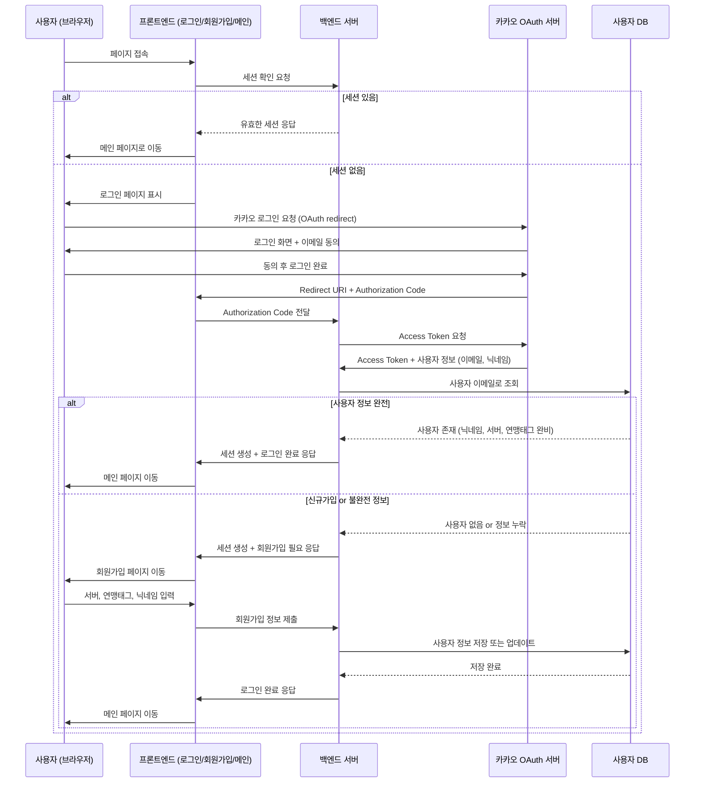

# 카카오 OAuth 로그인 및 회원가입 시스템 PRD

## 1. 프로젝트 개요

### 목적
기존 시스템에 카카오 OAuth 기반 로그인 및 회원가입 시스템을 도입하여 사용자 인증을 간소화하고 이메일 중복을 방지합니다.

### 핵심 가치
- 이메일 중복 방지를 위한 카카오톡 OAuth 단일 로그인
- 사용자 친화적인 회원가입 플로우
- 서버/연맹 정보 기반 사용자 관리
- 마스터/사용자 권한 시스템 구축

## 2. 기능 요구사항

### 2.1 로그인 시스템
**기본 플로우:**
1. 로그인 페이지에서 카카오톡 로그인 버튼만 제공 (이메일 중복 방지)
2. 카카오 OAuth를 통해 이메일 정보 필수 수집
3. 데이터베이스 조회하여 기존 회원 여부 확인
4. 기존 회원 (완전한 정보): 즉시 로그인 처리
5. 신규 사용자 또는 불완전 정보: 회원가입 페이지로 이동

**세션 관리:**
- 로그인 성공 시 세션 생성 및 유지
- 세션 만료 시 자동 로그인 페이지 리다이렉트

### 2.2 회원가입 시스템
**필수 입력 정보:**
- 서버 정보: 숫자만 입력 가능
- 연맹 태그: 문자열 4자리 고정
- 닉네임: 띄어쓰기/특수문자 불가

**검증 규칙:**
- 서버 정보: 숫자만 허용, 1-9999 범위
- 연맹 태그: 영문/숫자 조합 4자리 정확히
- 닉네임: 영문/숫자/한글만 허용, 2-20자

**재가입 처리:**
- 회원가입 중단 후 재로그인 시 회원가입 페이지 재진입
- 불완전한 정보 보유 시 (서버정보, 연맹 태그, 닉네임 중 누락) 회원가입 페이지로 이동

### 2.3 권한 관리 시스템
**역할 구분:**
- MASTER: 전체 관리 권한
- USER: 일반 사용자 권한

**마스터 권한 확인:**
- 카카오 로그인 이메일 기반 마스터 권한 부여
- 특정 서버/연맹 조합에 대한 마스터 권한 부여

## 3. 기술 사양

### 3.1 환경 설정
**로컬 환경:**
- 프론트엔드: http://localhost:3000
- 백엔드: http://localhost:8080

**운영 환경:**
- 프론트엔드: https://rokk.chunsik.site
- 백엔드: https://api.chunsik.site

### 3.2 카카오 OAuth 설정
**인증 정보:**
- REST API 키: fdca9c078cee7dd1ba2b731acc952362
- Client Secret: 1VucGS2KA3uFGf2AxJqeI80ZzDrSTKB9

**리다이렉트 URI:**
- 로컬: http://localhost:3000/auth/kakao/callback
- 운영: https://rokk.chunsik.site/auth/kakao/callback

**사이트 도메인:**
- 로컬: http://localhost:3000
- 운영: https://rokk.chunsik.site

### 3.3 데이터베이스 스키마

**기존 account 테이블 수정:**
```sql
-- account 테이블에 OAuth 관련 필드 추가
ALTER TABLE account ADD COLUMN IF NOT EXISTS server_info INTEGER;
ALTER TABLE account ADD COLUMN IF NOT EXISTS alliance_tag VARCHAR(4);
-- 기존 필드들:
-- kakao_id VARCHAR(100) UNIQUE NOT NULL
-- email VARCHAR(255)
-- nickname VARCHAR(100) NOT NULL
-- role VARCHAR(255) DEFAULT 'USER'
-- status VARCHAR(255) DEFAULT 'ACTIVE'
-- created_at, updated_at, last_login_at
```

**새로운 서버/연맹 관리 테이블:**
```sql
CREATE TABLE server_alliance_info (
    id SERIAL PRIMARY KEY,
    server_number INTEGER NOT NULL,
    alliance_tag VARCHAR(4) NOT NULL,
    alliance_name VARCHAR(100),
    is_master_alliance BOOLEAN DEFAULT FALSE,
    created_at TIMESTAMP DEFAULT CURRENT_TIMESTAMP,
    updated_at TIMESTAMP DEFAULT CURRENT_TIMESTAMP,
    UNIQUE(server_number, alliance_tag)
);
```

**세션 관리 테이블 (기존 user_sessions 활용):**
```sql
-- 기존 user_sessions 테이블을 account 테이블과 연결
ALTER TABLE user_sessions 
DROP CONSTRAINT IF EXISTS user_sessions_user_seq_fkey,
ADD CONSTRAINT user_sessions_user_id_fkey 
FOREIGN KEY (user_seq) REFERENCES account(user_id) ON DELETE CASCADE;
```

## 4. 사용자 플로우

### 4.1 로그인 플로우
```
페이지 접속 → 세션 확인 → [세션 유효] → 메인 페이지
                     ↓ [세션 무효]
              로그인 페이지 → 카카오 로그인 버튼 → 카카오 OAuth 인증
                                                        ↓
              [기존 회원] ← 사용자 정보 확인 → [신규/불완전] → 회원가입 페이지
                     ↓                                        ↓
              세션 생성 → 메인 페이지                  정보 입력 → 가입 완료 → 메인 페이지
```

### 4.2 회원가입 플로우
```
회원가입 페이지 → 서버 정보 입력 (숫자) → 검증
                     ↓
              연맹 태그 입력 (4자리) → 검증
                     ↓
              닉네임 입력 (검증) → 폼 제출 → 사용자 정보 저장 → 로그인 완료
```

### 4.3 시퀀스 다이어그램


## 5. API 명세

### 5.1 인증 관련 API
```
POST /auth/kakao/login
- 카카오 Authorization Code를 받아 토큰 교환 및 사용자 정보 조회
- Request: { code: string, redirect_uri: string }
- Response: { status: 'login' | 'signup_required', user: UserInfo, session: SessionInfo }

GET /auth/session/check
- 현재 세션 유효성 확인
- Response: { valid: boolean, user?: UserInfo }

POST /auth/logout
- 세션 무효화 및 로그아웃 처리
- Response: { success: boolean }

POST /auth/signup
- 회원가입 정보 저장 및 세션 생성
- Request: { server_info: number, alliance_tag: string, nickname: string }
- Response: { success: boolean, user: UserInfo }
```

### 5.2 사용자 관리 API
```
GET /api/user/profile
- 현재 로그인한 사용자 정보 조회
- Response: UserInfo

PUT /api/user/profile
- 사용자 정보 수정 (서버, 연맹, 닉네임)
- Request: { server_info?: number, alliance_tag?: string, nickname?: string }

GET /api/user/role
- 사용자 권한 정보 조회
- Response: { role: 'MASTER' | 'USER', permissions: string[] }
```

### 5.3 서버/연맹 관리 API
```
GET /api/server-alliance
- 서버/연맹 목록 조회
- Response: ServerAllianceInfo[]

POST /api/server-alliance
- 새 서버/연맹 정보 등록 (마스터 권한 필요)
- Request: { server_number: number, alliance_tag: string, alliance_name?: string }

PUT /api/server-alliance/:id/master
- 마스터 연맹 설정 (마스터 권한 필요)
- Request: { is_master_alliance: boolean }
```

## 6. 보안 고려사항

### 6.1 인증 보안
- HTTPS 통신 강제 (운영 환경)
- 세션 토큰 암호화 저장
- CSRF 토큰 적용
- Rate Limiting 적용

### 6.2 데이터 보안
- 개인정보 암호화 저장
- SQL Injection 방지
- XSS 공격 방지
- 민감정보 로깅 제외

### 6.3 권한 관리
- 역할 기반 접근 제어 (RBAC)
- API 엔드포인트별 권한 검증
- 마스터 권한 이중 확인 (이메일 + 서버/연맹)

## 7. 테스트 계획

### 7.1 기능 테스트
- 카카오 로그인 플로우 테스트
- 회원가입 플로우 테스트
- 세션 관리 테스트
- 권한 시스템 테스트

### 7.2 테스트 페이지 개발
```
/test/auth-status - 인증 상태 확인 페이지
/test/permissions - 권한 테스트 페이지
/test/session-info - 세션 정보 확인 페이지
/test/kakao-oauth - 카카오 OAuth 플로우 테스트 페이지
```

## 8. 구현 순서

### Phase 1: 백엔드 기반 구조
1. 데이터베이스 스키마 생성 및 수정
2. Account 엔티티 및 Repository 구현
3. 서버/연맹 관리 엔티티 구현
4. 카카오 OAuth 서비스 구현
5. 인증 관련 API 개발

### Phase 2: 프론트엔드 인증 시스템
1. 로그인 페이지 개발
2. 회원가입 페이지 개발
3. 세션 관리 로직 구현
4. 라우팅 가드 구현

### Phase 3: 통합 및 테스트
1. 전체 플로우 테스트
2. 권한 시스템 검증
3. 테스트 페이지 개발
4. 보안 점검
5. 성능 최적화

### Phase 4: 카카오 개발자 콘솔 설정
1. 웹 플랫폼 사이트 도메인 등록
2. Redirect URI 설정
3. 권한 항목 설정 (이메일, 닉네임)

## 9. 카카오 개발자 콘솔 설정

### 9.1 웹 플랫폼 사이트 도메인
- 로컬 개발: http://localhost:3000
- 운영 환경: https://rokk.chunsik.site

### 9.2 Redirect URI 설정
- 로컬 개발: http://localhost:3000/auth/kakao/callback
- 운영 환경: https://rokk.chunsik.site/auth/kakao/callback

### 9.3 동의항목 설정
- 필수 동의: 이메일 주소
- 선택 동의: 닉네임 (카카오계정에 설정된 이름)

### 9.4 비즈니스 설정
- 앱 이름: LastWar Management System
- 앱 설명: 라스트워 연맹 관리 시스템

## 10. 운영 고려사항

### 10.1 모니터링
- 로그인 성공/실패율 모니터링
- 회원가입 전환율 추적
- 세션 만료 패턴 분석
- API 응답 시간 모니터링

### 10.2 유지보수
- 카카오 API 정책 변경 대응
- 사용자 피드백 수집 및 개선
- 보안 업데이트 정기 적용
- 데이터베이스 성능 최적화

## 11. 성공 지표

### 11.1 정량적 지표
- 로그인 성공률 > 95%
- 회원가입 완료율 > 80%
- 세션 유지 시간 > 24시간
- API 응답 시간 < 500ms

### 11.2 정성적 지표
- 사용자 만족도 조사
- 고객 지원 문의 감소
- 보안 인시던트 제로
- 시스템 안정성 향상

## 12. 위험 요소 및 대응방안

### 12.1 기술적 위험
- 카카오 API 장애: 대체 인증 방법 준비
- 세션 관리 문제: Redis 등 외부 세션 스토리지 고려
- 데이터베이스 성능: 인덱스 최적화 및 쿼리 튜닝

### 12.2 비즈니스 위험
- 사용자 저항: 충분한 안내 및 교육
- 데이터 마이그레이션: 단계적 전환 및 백업 계획
- 권한 관리 복잡성: 명확한 권한 매트릭스 정의

---

**PRD 작성일:** 2025년 1월 8일  
**작성자:** Claude Code  
**버전:** 1.0